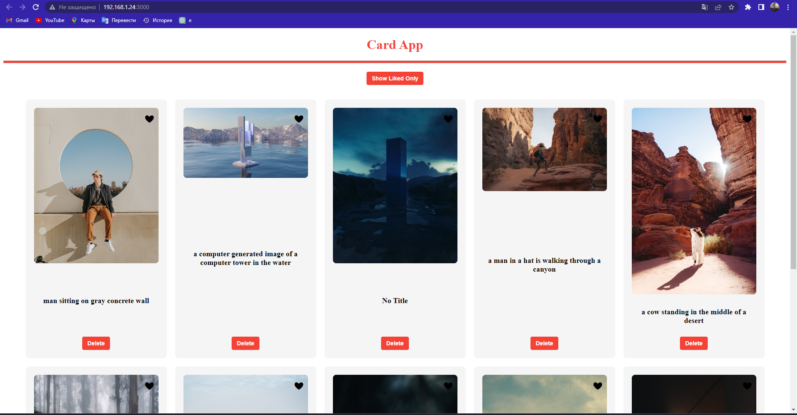

# Card App



Card App - это приложение, которое позволяет отображать карточки с картинками и описанием, полученные с использованием API Unsplash. Вы можете лайкать и удалять карточки, а также фильтровать карточки по лайкам.

[Демонстрация на GitHub Pages](https://adilkhan-git.github.io/cards/)


## Как использовать
1. Склонируйте репозиторий:

   ```bash
   git clone git@github.com:adilkhan-git/cards.git
   ```

2. Перейдите в директорию проекта:
    ```bash
    cd cards
    ```
3. Установите зависимости:
    ```bash
    npm install
    ```
4. Запустите приложение:
    ```bash
    npm start
    ```

Приложение будет запущено локально и будет доступно по адресу [http://localhost:3000](http://localhost:3000).

## Функциональность

В приложении Card App вы можете:

- Просматривать карточки с картинками и описанием
- Лайкать карточки
- Удалять карточки
- Фильтровать карточки по лайкам

## Технологии

В проекте использованы следующие технологии:

- React: JavaScript-библиотека для создания пользовательских интерфейсов
- API Unsplash: сервис для получения фотографий

